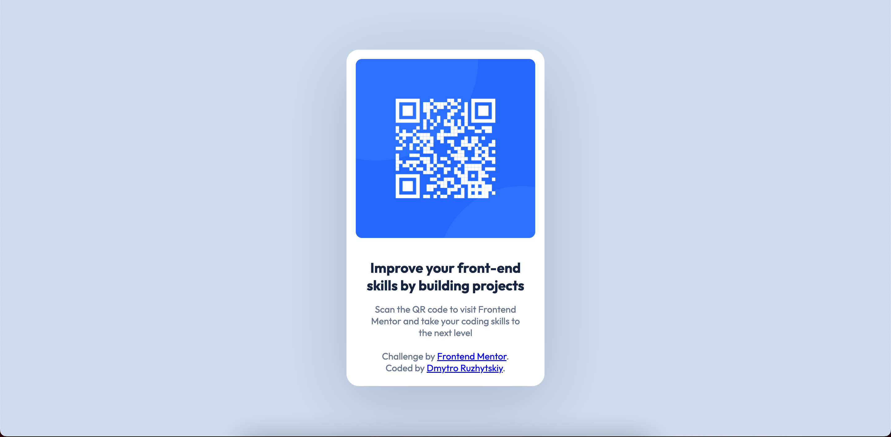

# Frontend Mentor - QR code component solution

This is a solution to the [QR code component challenge on Frontend Mentor](https://www.frontendmentor.io/challenges/qr-code-component-iux_sIO_H). 

## Table of contents

- [Overview](#overview)
  - [Screenshot](#screenshot)
  - [Links](#links)
- [My process](#my-process)
  - [Built with](#built-with)
  - [What I learned](#what-i-learned)
- [Author](#author)

**Note: Delete this note and update the table of contents based on what sections you keep.**

## Overview

### Screenshot



### Links

- Solution URL: [click!](https://github.com/dimxn/qr-code-component-main)
- Live Site URL: [click!](https://dimxn.github.io/qr-code-component-main)

## My process

### Built with

- Semantic HTML5 markup
- CSS custom properties
- CSS Grid
- Mobile-first workflow


### What I learned

I learned how to position elements in the center of the screenю
This is shown in more detail belowю


```css
.content {
  position: absolute;
  top: 50%;
  left: 50%;
  transform: translate(-50%, -50%);
}
```

## Author

- Website - [dmytror.pp.ua](https://www.dmytror.pp.ua/)
- Frontend Mentor - [@dimxn](https://www.frontendmentor.io/profile/dimxn)
- Instagram - [@dmytr.off](https://www.instagram.com/dmytr.off)

